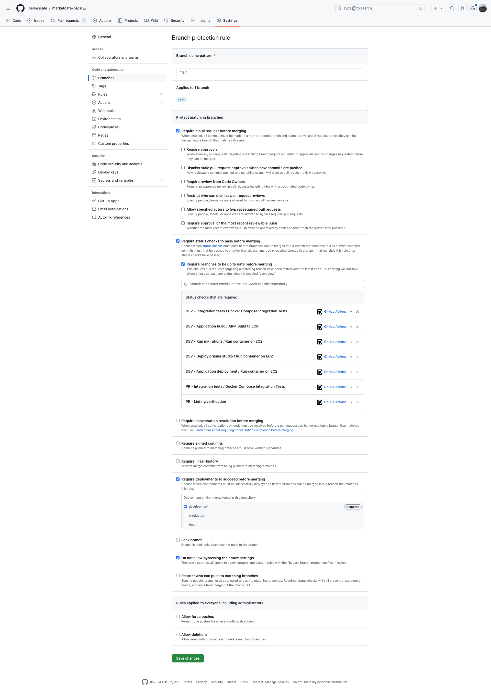

# Locking Pull Requests



# Passing secrets independently

```yml
name: Pull Requests CI/CD
on: [ pull_request ]
jobs:
  integration-tests:
    name: Integration tests
    uses: peruescafe/marketcafe-devops/.github/workflows/integration-test.yml@main
    needs: lint-check
    with:
      ENVIRONMENT: test
    secrets:
      database-url: ${{ secrets.DATABASE_URL }}

```

```yml
on: 
  workflow_call:
    inputs:
      ENVIRONMENT:
        required: true
        type: string
    secrets:
      DATABASE_URL:
        required: true

jobs:
  integration-test:
    name: Integration test reusable workflow
    runs-on: ubuntu-latest
    environment: ${{ inputs.ENVIRONMENT }}
    steps:
      - name: Checkout code
        uses: actions/checkout@v4
      - name: Test docker-compose
        env:
          DATABASE_URL: ${{ secrets.DATABASE_URL }}
        run: docker-compose -f docker-compose-test.yml up --exit-code-from integration-test
```

# Passing all secrets

```yml
name: Pull Requests CI/CD
on: [ pull_request ]
jobs:
  integration-tests:
    name: Integration tests
    uses: peruescafe/marketcafe-devops/.github/workflows/integration-test.yml@main
    needs: lint-check
    with:
      ENVIRONMENT: test
    secrets: inherit
```

```yml
on: 
  workflow_call:
    inputs:
      ENVIRONMENT:
        required: true
        type: string
    secrets:
      DATABASE_URL:
        required: true

jobs:
  integration-test:
    name: Integration test reusable workflow
    runs-on: ubuntu-latest
    environment: ${{ inputs.ENVIRONMENT }}
    steps:
      - name: Checkout code
        uses: actions/checkout@v4
      - name: Test docker-compose
        env:
          DATABASE_URL: ${{ secrets.DATABASE_URL }}
        run: docker-compose -f docker-compose-test.yml up --exit-code-from integration-test
```

# Development workflow

## Building docker image

## Uploading to ECR

## Deploying to EC2

# Passing variables

```yml
name: Development CI/CD
on:
  push:
    branches: [ development ]
jobs:
  deploy-app:
    name: Application deployment
    needs: run-migrations
    uses: peruescafe/marketcafe-devops/.github/workflows/deploy-on-ec2.yml@main
    secrets: inherit
    with:
      ENVIRONMENT: development
      IMAGE_TAG: ${{ github.sha }}
      EXECUTION_COMMAND: 'npm run start:prod'
```

```yml
on:
  workflow_call:
    inputs:
      IMAGE_TAG:
        required: true
        type: string
      EXECUTION_COMMAND:
        required: true
        type: string
      ENVIRONMENT:
        required: true
        type: string
    secrets:
      EC2_USERNAME:
        required: true
      ECR_REGISTRY:
        required: true
      SSH_KEY:
        required: true
      AWS_ACCOUNT_ID:
        required: true
      DATABASE_URL:
        required: true
env:
  HOSTNAME: ${{ vars.EC2_IP_ADDRESS }}
  USER_NAME: ${{secrets.EC2_USERNAME}}
  ECR_REPOSITORY: ${{ vars.ECR_REPOSITORY }}
  ECR_REGISTRY: ${{ secrets.ECR_REGISTRY }}
  AWS_REGION: ${{ vars.AWS_REGION }}
  NODE_ENV: ${{ vars.NODE_ENV }}
  APP_PORT: ${{ vars.APP_PORT }}
  IMAGE_TAG: ${{ inputs.IMAGE_TAG }}
jobs:
  test:
    name: Application deployment
    runs-on: ubuntu-latest
    environment: ${{ inputs.ENVIRONMENT }}
    steps:
      - name: Prepare EC2 SSH credentials
        env:
          PRIVATE_KEY: ${{ secrets.SSH_KEY }}
        run: |
          echo "$PRIVATE_KEY" > private_key && chmod 600 private_key;
          echo "ssh -o StrictHostKeyChecking=no -i private_key ${USER_NAME}@${HOSTNAME}";
      - name: Login to ECR on EC2
        env:
          AWS_ACCOUNT_ID: ${{ secrets.AWS_ACCOUNT_ID }}
        run: |
          ssh -o StrictHostKeyChecking=no -i private_key ${USER_NAME}@${HOSTNAME} "aws ecr get-login-password --region ${AWS_REGION} | docker login --username AWS --password-stdin ${AWS_ACCOUNT_ID}.dkr.ecr.${AWS_REGION}.amazonaws.com"
      - name: Stop running app
        run: |
          ssh -o StrictHostKeyChecking=no -i private_key ${USER_NAME}@${HOSTNAME} "docker stop ${ECR_REPOSITORY}-${NODE_ENV} || true"
      - name: Clean unused containers
        run: |
          ssh -o StrictHostKeyChecking=no -i private_key ${USER_NAME}@${HOSTNAME} "docker system prune -f"
      - name: Clean unused images
        run: |
          ssh -o StrictHostKeyChecking=no -i private_key ${USER_NAME}@${HOSTNAME} "docker image prune -af"
      - name: Start app
        env:
          DATABASE_URL: ${{ secrets.DATABASE_URL }}
          EXECUTION_COMMAND: ${{ inputs.EXECUTION_COMMAND }}
        run: |
          ssh -o StrictHostKeyChecking=no -i private_key ${USER_NAME}@${HOSTNAME} "
            docker run \
              --name ${ECR_REPOSITORY}-${NODE_ENV} \
              -e DATABASE_URL=${DATABASE_URL} \
              -e APP_PORT=${APP_PORT} \
              -p ${APP_PORT}:${APP_PORT} \
              -d $ECR_REGISTRY/$ECR_REPOSITORY:$IMAGE_TAG \
              $EXECUTION_COMMAND
          "
```

Solution:

- Moving vars to secrets?
- Using vars only for global configurations?